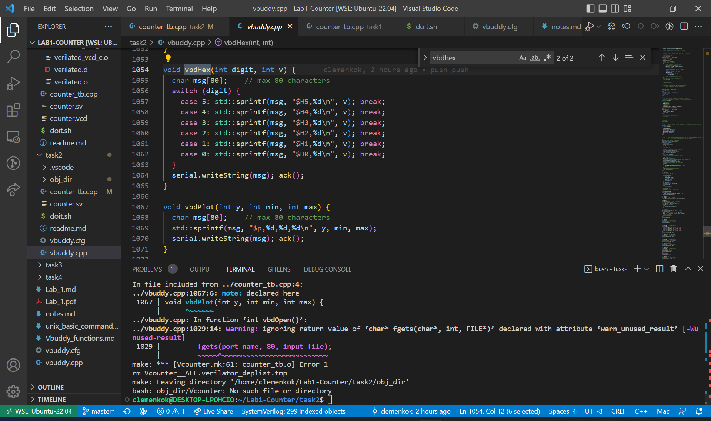
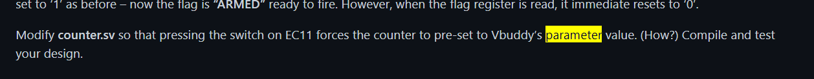
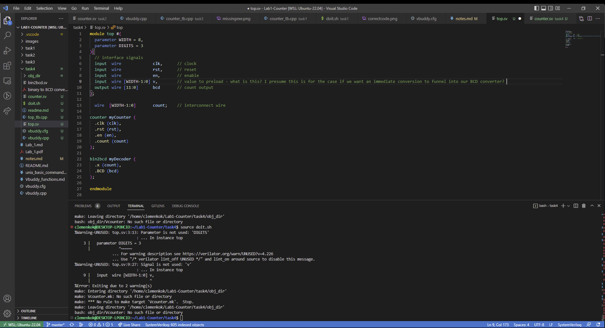
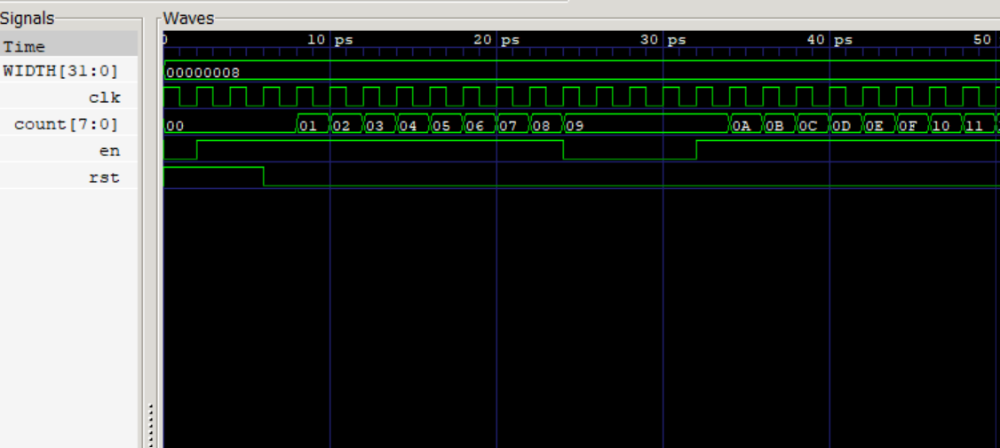
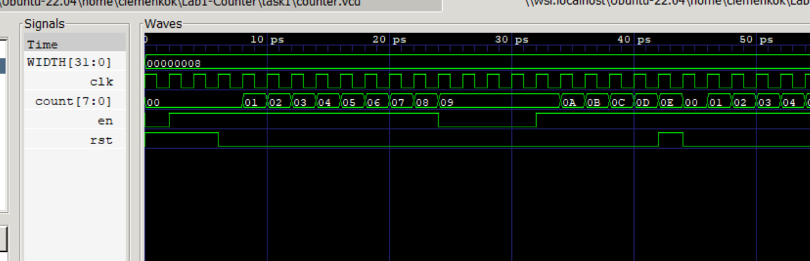
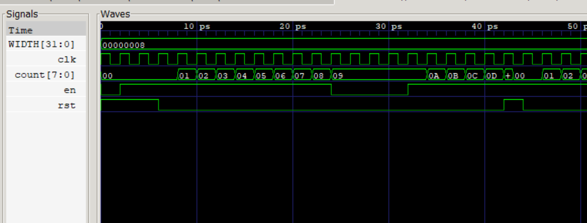

# EIE2 IAC Notes by Clemen Kok (ck21)

## Make a binary Counter

```
{
  module counter #(
    paramater WIDTH = 8
)(
    // interface signals
    input logic                    clk, //clock
    input logic                    rst, //reset
    input logic                    en,  //counter enable
    output logic [WIDTH-1:0]       count //count output
);

always_ff @ (posedge clk)
    if (rst) count <= {WIDTH{1'b0}};
    else     count <= count + {{WIDTH-1{1'b0}}, en};

endmodule
}
```  

Note the following:  
1.	The file name and the module name must be the same.  
2.	The number of bits in the counter is specified with the parameter WIDTH. It is currently set to 8-bit.   
3.	The always_ff @ (posedge clk) is the way that one specifies a clocked circuit.  
4.	‘<=’ in line 12 and 13 are non-block assignments which should be used within an always_ff block.  
5.	{WIDTH{1’b0}} in line 12 uses the concatenation operator { } to form WIDTH bits of ‘0’. (Can you explain the construct in line 13?)  

When rst is = 0, else flag triggered, this adds the current count to a concatnated set of 0s (with the number of zeroes being 1 less then specified width) with the current enable signal. The concatnation is necessary to ensure that count and en are of the same bitsize.

## Problems Encountered

### System  

We faced several issues. I initially used Windows VSCode to clone the GitHub Folder but this created an issue where binaries were not loaded into Windows as the earlier Bash script to install was run in Ubuntu 22.04. Furthermore after entering WSL Ubuntu, it worked temporarily but Ubuntu does not allow access to COMS ports in Windows systems so Ubuntu 22.04 has to be used. Thus I copied over the files into Ubuntu 22.04 and thereafter it worked as I was able to access Vbuddy.  

GTKWave had to be installed on Windows and .vcd files were loaded into Windows GTKWave instead of Ubuntu WSL.  

### Halt  

VBuddy.cpp presented several errors after trying to run. Despite successfully connecting to the VBuddy board, we were unable to increase the counter count. The testbench in Task 1 showed that the module simulates correctly. However errors in VBuddy.cpp prevented us from seeing the simulation live. 

### Starting the Count Properly

We realised that the count would only increase if we make the flag positive and turn the wheel. This allows the enable signal to be registered and increased the count of the counter. 

# Missing Executable

After running `vbdPlot` instead of `vbdHex` we note that there was an issue with the creation of the executable.



# Correct Code?

`counter.sv` does not seem to be the correct file that should be modified to serve the function of converting the current number to the stored parameter value.  



# Unused Values

`top.sv` has input signals `v` and a parameter `DIGITS` which are unused. We are told to modify the testbench `top_tb.cpp` and not `top.sv` but we have to use the input signal and parameter if we want to compile. One way is that I thought of is to create another module or modify existing modules to utilise the 8-bit v input wire (preloaded via testbench) to give the BCD equivalent of this number.



## Challenges

```
{
top->rst = (i<2);
top->en = (i<11) | (i>14);
}
```

We adjust the clock cycles for which en is triggered to meet the criteria of not incrementing for 3 cycles at 0x9. Hence top->rst and top->en cycles have been adjusted as seen above. This gives us the GTKWave output as seen below.



We also adjust `counter.sv` to make reset asynchronous.

```
{
always_ff @ (posedge clk, posedge rst) // asynchronous reset
if (rst) count <= {WIDTH{1'b0}}; 
else     count <= count + {{WIDTH-1{1'b0}}, en};
endmodule
}
```

This causes the counter to not increase in the same clock cycle as the reset. Reset applies at the current rising edge of the clock. Comparatively for a synchoronous reset the reset only applies on the next rising edge of the clock.  




```
{
//initialize simualation inputs
    top->clk = 1;
    top->rst = 1;
    top->en = 0;
    top-> value = 0;

    //run simulation for many clock cycles
    for (i=0; i<300;i++){

        //dump variables into VCD file and toggle clock
        for (clk=0;clk<2;clk++){
            tfp->dump(2*i+clk);
            top->clk = !top->clk;
            top->eval ();
        }

        // ++++ send count value to Vbuddy (output count values to 7-seg display every cycle)
        vbdHex(4,(int(top->count)>>12)&0xF);
        vbdHex(3,(int(top->count)>>8)&0xF);
        vbdHex(2,(int(top->count)>>4)&0xF);
        vbdHex(1,int(top->count) &0xF);
        vbdCycle(i+1);
        // ----- end of Vbuddy output section

        // change input stimuli
        top->rst = vbdFlag();
        top->value = vbdValue();
        vbdSetMode(1); // one-shot behaviour, reflects input stimuli change. 
}
```

```
{
module counter #(
    parameter WIDTH = 8
)(
    // interface signals
    input logic                    clk, //clock
    input logic                    rst, //reset
    input logic                    en,  //counter enable
    input logic [WIDTH-1:0]        value,
    output logic [WIDTH-1:0]       count //count output
);

always_ff @ (posedge clk)
    if (rst) count <= value;
    else     count <= count + {{WIDTH-1{1'b0}}, en};

endmodule

}
```

the above code snippet allows us to (1) press the switch to arm and fire the flag, and (2) set the counter value to vbdValue(). this happens by having rst triggered upon the flag fire, which then passes the current vbdValue (which is saved in hardware as `value`) to the counter value.

When the switch is pressed, rst becomes 1 (but only fires once due to `vbdSetMode()`) which passes value into the current count see `counter.sv`. 

```
{
top->rst = (i<2) | (i==15);
        top->en = vbdFlag();
        vbdSetMode(1);
}
```

This adjustment allows us to single-step the counter.  

The BCD Algorithm is used to convert a binary number into a BCD. We do this by shifting left, checking for >=5 and adding 3 if so until all bits have been shifted left. 

The file `top.sv` is not complete and requires adjustments.